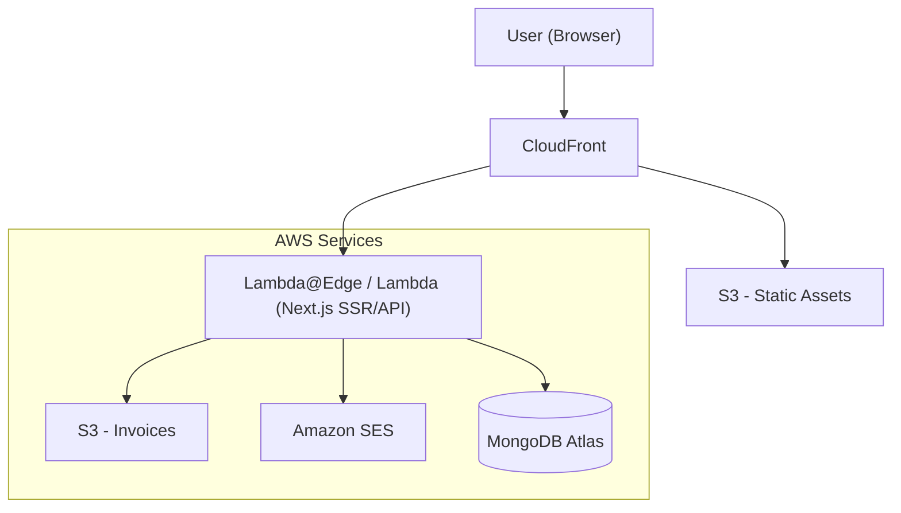
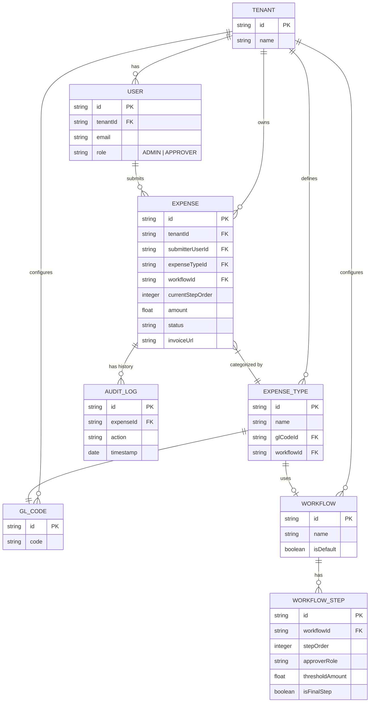
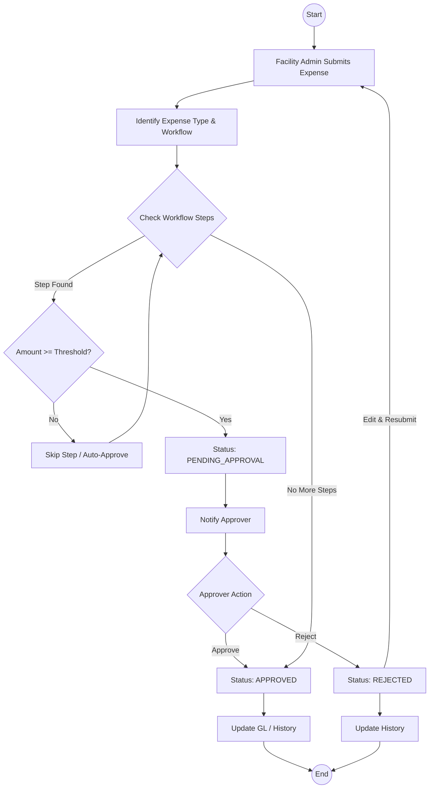

# High Level Design (HLD) - Multi-tenant Expense Management System

## 1. Executive Summary
A multi-tenant expense management system allowing Facility Admins to submit expenses and Approvers to review them. The system supports multi-tenancy, SSO integration, and comprehensive reporting.

## 2. Architecture Overview
The system is built as a **Fullstack Next.js Application** deployed on AWS using CDK.

## 3. Key Components

### 3.1 Frontend & Backend (Next.js)
- **Framework**: Next.js (App Router recommended).
- **Language**: TypeScript.
- **Validation**: Zod (Shared schemas between front/back).
- **Authentication**: Azure Entra ID (Integrated via NextAuth.js or custom provider).
- **Testing**: Jest + React Testing Library (Unit), Storybook (Components).

### 3.2 Key Services (Internal Modules)
- **Expense Module**: Submission, Validation (Zod), Storage.
- **Approval Module**: Workflow, Status updates.
- **Notification Module**: Amazon SES for email alerts.
- **Reporting Module**: Aggregation.

### 3.3 Database & Storage
- **Database**: MongoDB (Mongoose ORM).
- **File Storage**: Amazon S3 (Invoice attachments).

#### Entity Relationship Diagram

### 3.4 New Collections
- **Expense Types**: Configurable categories (e.g., Travel, Meals) mapped to GL Codes.
- **GL Codes**: General Ledger codes.
- **Workflows**: Ordered sets of approval steps.
- **Workflow Steps**: Defines `approverRole` and `thresholdAmount`.

## 4. Workflows

### 4.1 Expense Submission Logic

1. Facility Admin fills form (Client-side Zod validation).
2. Uploads Invoice.
3. Submits to Backend.
4. Backend identifies `ExpenseType` -> Finds associated `Workflow` (or Tenant Default).
5. **Workflow Evaluation**:
    - Iterate through `WorkflowSteps` ordered by `stepOrder`.
    - Check `if (expense.amount >= step.thresholdAmount)`.
    - If true, set `currentStepOrder` = this step, status = `PENDING_APPROVAL`, assigned to `step.approverRole`.
    - If false, skip step.
    - If all steps are skipped (auto-approve), status = `APPROVED`.
6. Saves to MongoDB.
7. Triggers Notification.

### 4.2 Approval
1. Approver views pending expenses.
2. Approves/Rejects.
3. Updates DB.
4. Triggers SES Email to Submitter.

## 5. Deployment Strategy
- **Infrastructure**: AWS CDK.
- **Compute**: Next.js deployed via Lambda (using adapters like `OpenNext` or CDK constructs) or Fargate. (Assuming Lambda for serverless preference).
- **CI/CD**: GitHub Actions -> CDK Deploy.

## 6. Security & Quality
- **Auth**: Azure Entra ID (OIDC).
- **Validation**: Strict Zod schemas.
- **Code Quality**: ESLint, Prettier.
