# Invoice Cursor - Workflow Diagrams

## System Architecture Overview

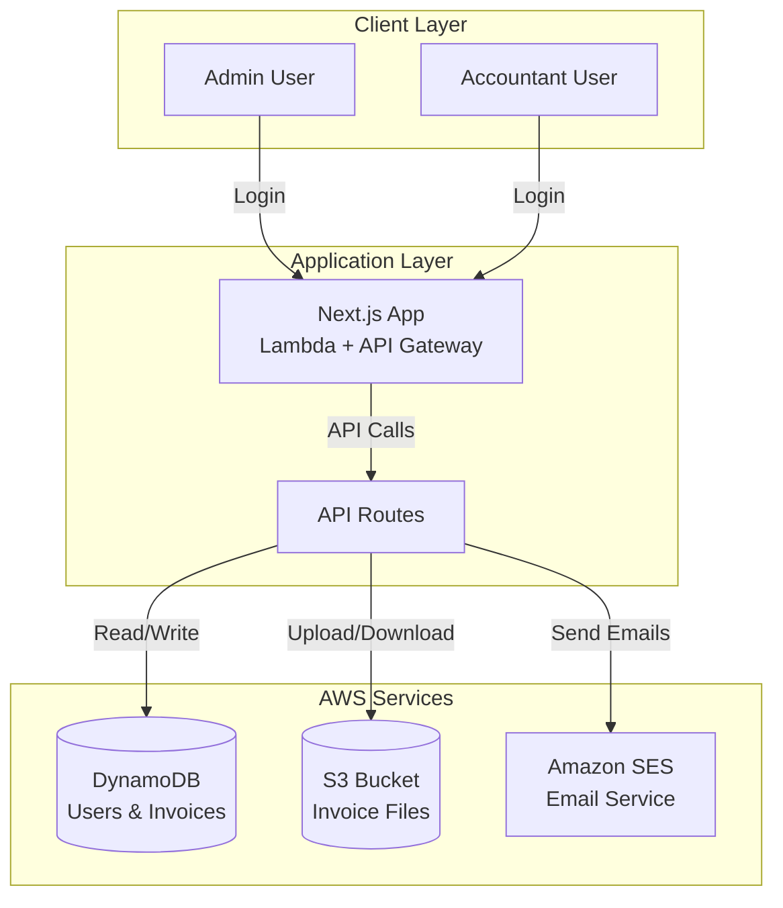

## Authentication Flow

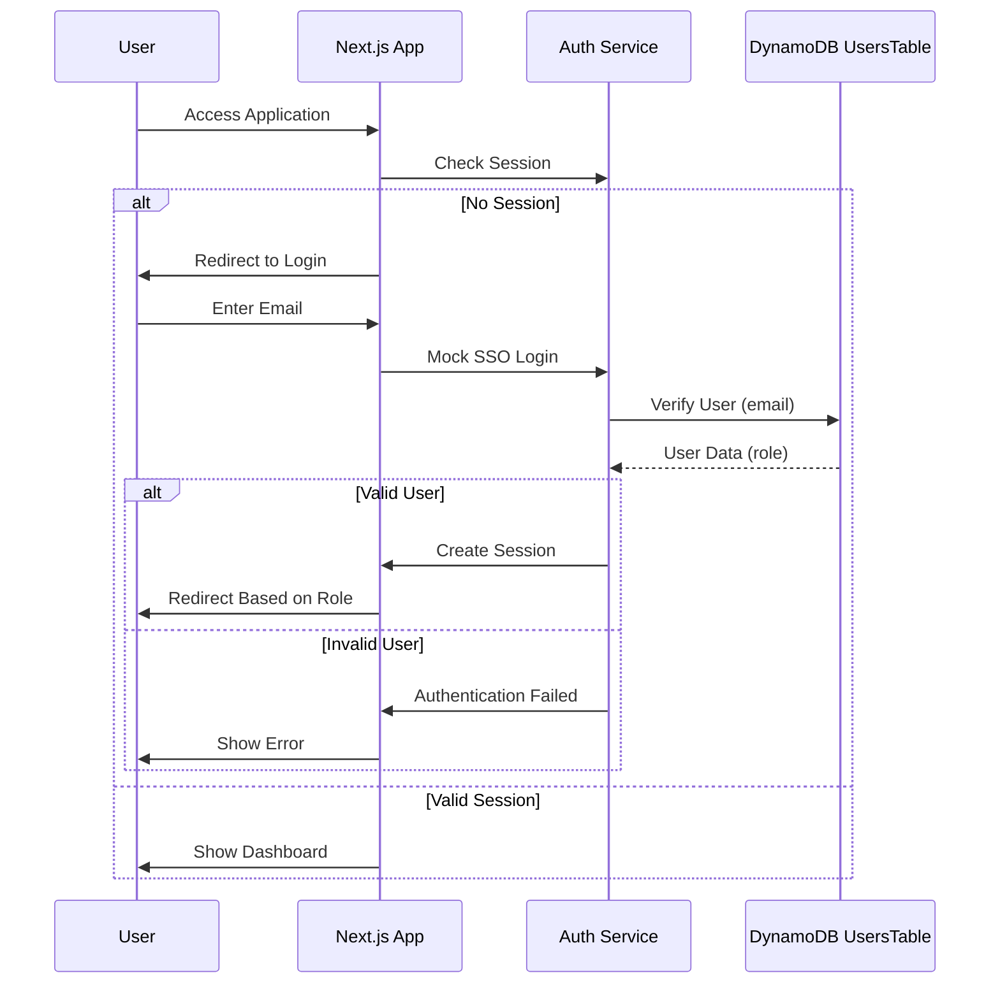

## Admin Workflow - Invoice Submission

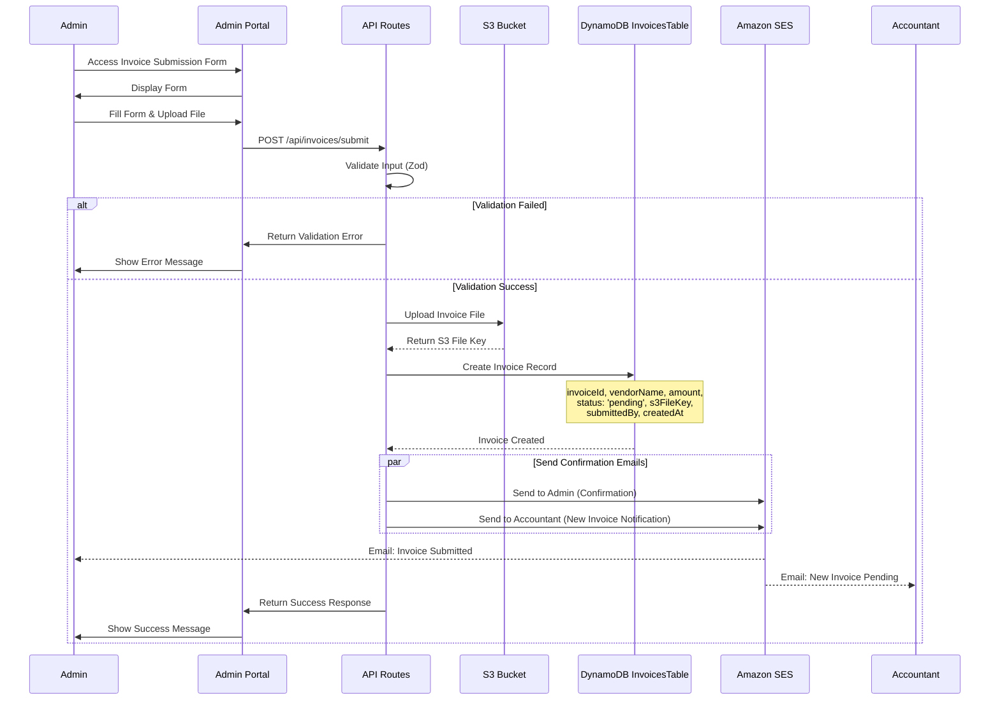

## Accountant Workflow - Invoice Management

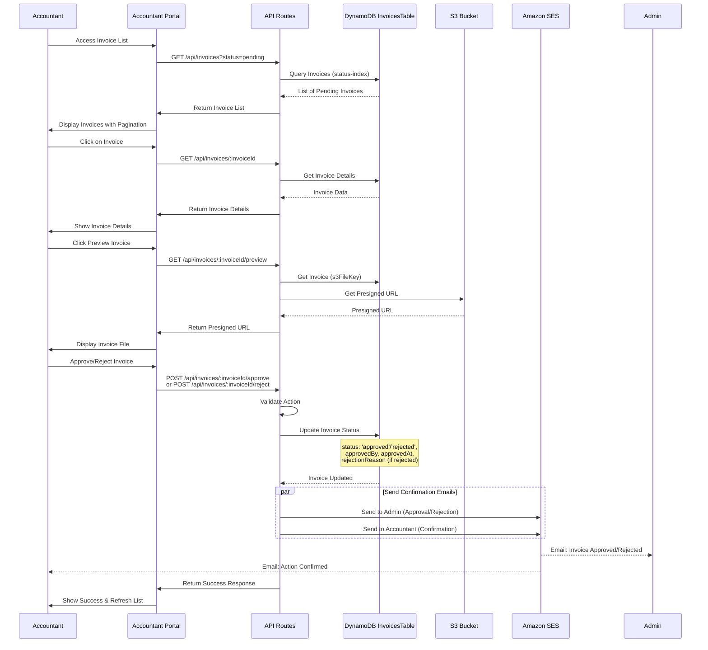

## CSV Export Workflow

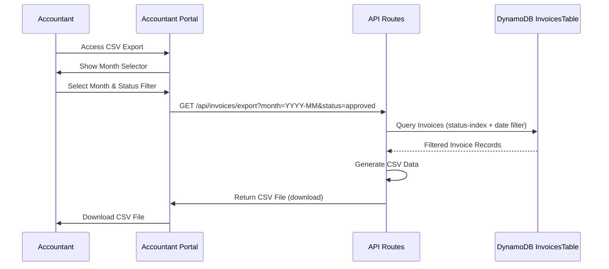

## Search Workflow

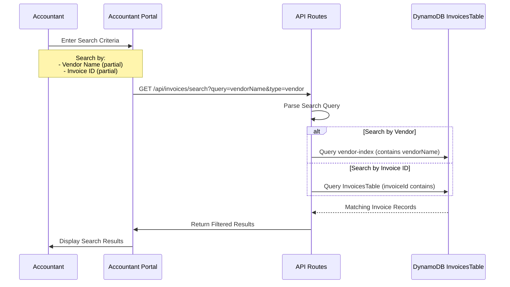

## Email Notification Flow

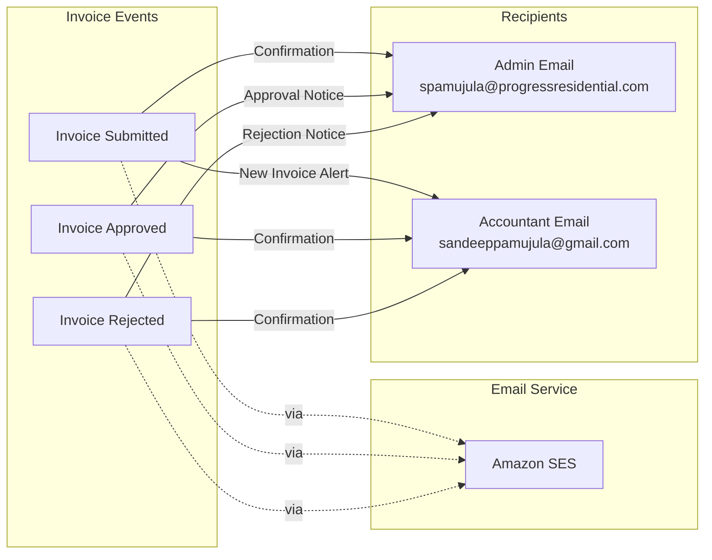

## Data Flow - Invoice Submission

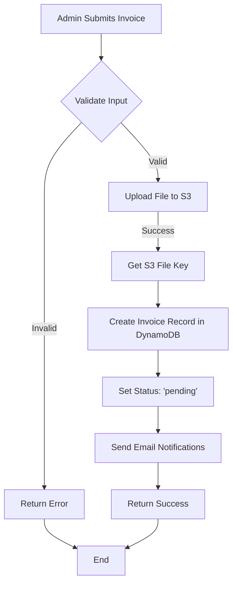

## Data Flow - Invoice Approval

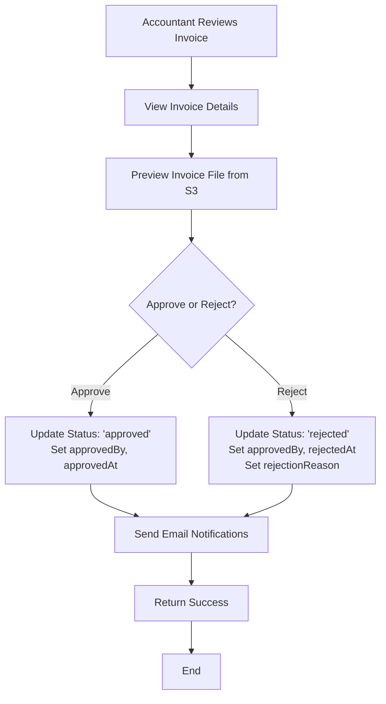

## Complete User Journey

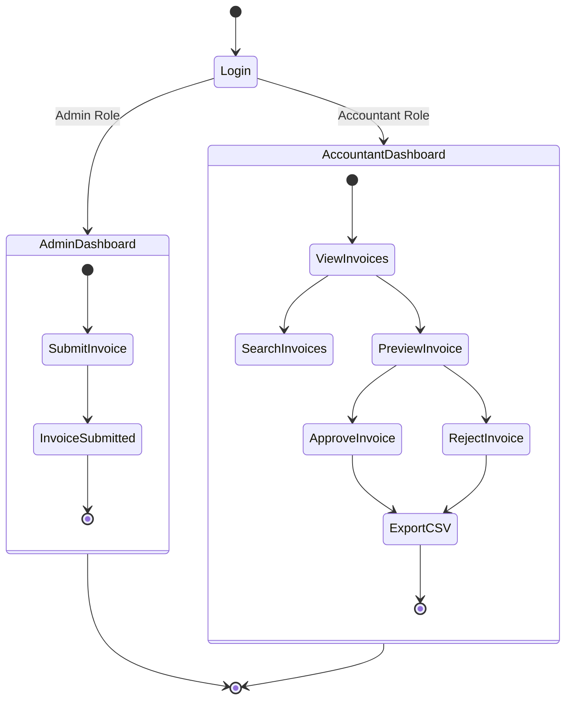

## System Components Interaction

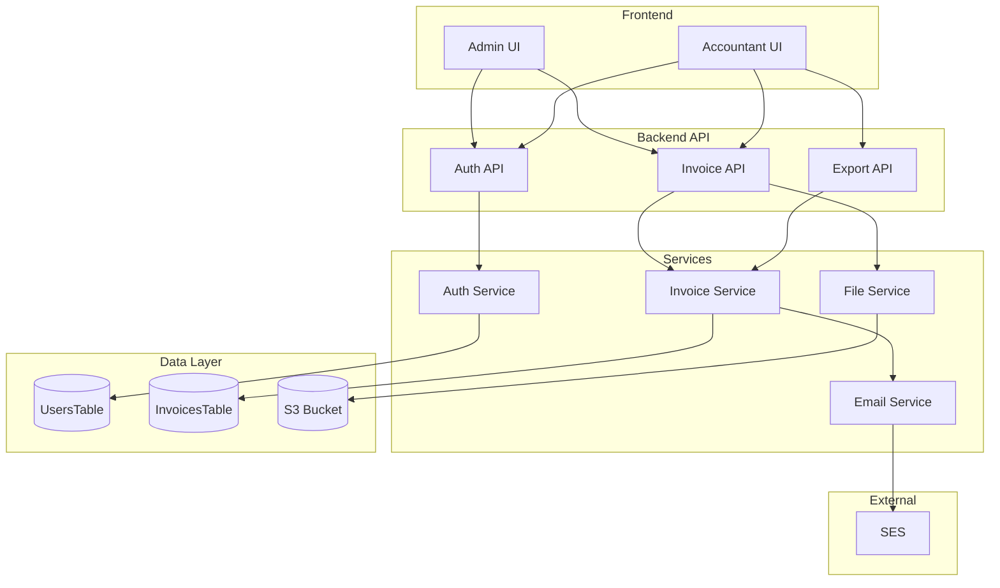

