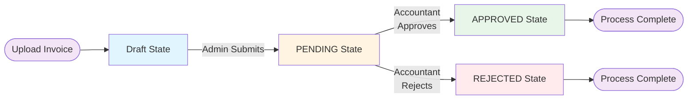

# Invoice Cursor - Workflow Diagrams

## High-Level State Diagram

### Invoice Lifecycle State Machine

### Simplified Invoice State Flow V1

```mermaid
graph LR
    Start([Upload Invoice]) --> Draft[Draft State]
    Draft -->|Admin Submits| Pending[PENDING State]
    
    Pending -->|Accountant<br/>Approves| Approved[APPROVED State]
    Pending -->|Accountant<br/>Rejects| Rejected[REJECTED State]
    
    Approved --> End1([Process Complete])
    Rejected --> End2([Process Complete])
    
    style Draft fill:#e1f5ff
    style Pending fill:#fff4e1
    style Approved fill:#e8f5e9
    style Rejected fill:#ffebee
    style Start fill:#f3e5f5
    style End1 fill:#f3e5f5
    style End2 fill:#f3e5f5
```

