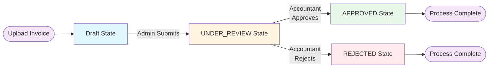
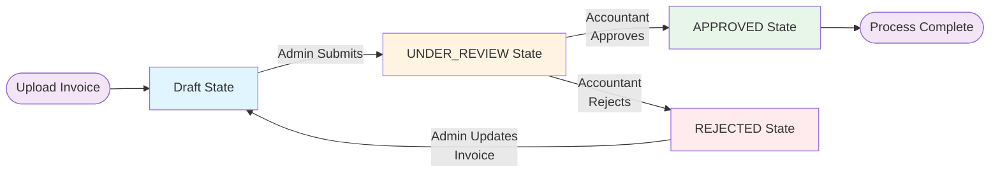

# Invoice Cursor - Workflow Diagrams

## High-Level State Diagram

### Invoice Lifecycle State Machine

### Simplified Invoice State Flow V1

### Simplified Invoice State Flow V2 (With Resubmission)

**Note:** When an invoice is in REJECTED state, the Admin can:
- Update invoice details
- Upload new file
- Resubmit for review (transitions back to Draft, then to Under-Review)

